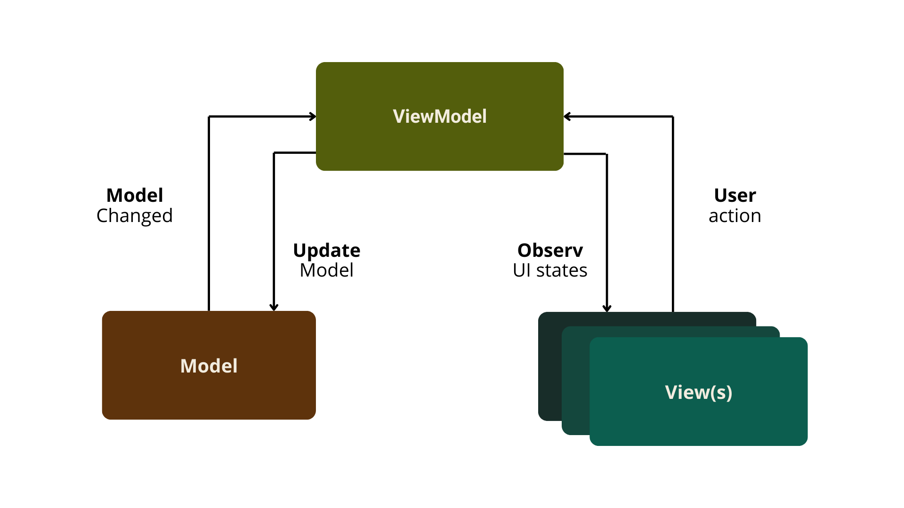

# H-Buddy - Herbal Image Classification APP

Introducing H-Buddy, a helpful companion for anyone interested in herbs. With just a photo from your camera or gallery, H-Buddy can identify various herbs and provide you with detailed information, including descriptions, nutritional content and health benefits. In addition, H-Buddy offers articles with guidance on how to turn these herbs into healthy consumer goods. Whether you are new to herbs or experienced, H-Buddy is here to support your herbal journey with useful and practical information.

  

## Libraries and Technology Stacks
- Minimum SDK 24, Nougat, Android 7
- Figma
- Android Studi (Fully using Kotlin)
- Material Design 3
- MVVM Architecture
- [Dagger Hilt](https://developer.android.com/training/dependency-injection/hilt-android?hl=id) - Dependency Injection
- [Firebase](https://firebase.google.com/docs/auth) - Firebase Authentication
- [Retrofit2 and Okhttp](https://github.com/square/retrofit) - Networking APIs

## User Interface
- [H-Buddy](https://www.figma.com/design/ULRFAuUiR5AOvvo6tR0JwL/H-Buddy?node-id=54799-114&t=wW62JikOCx3L9glk-1) - Figma

## This App was built with MVVM Architecture

  

## Getting Started

- **Install H-Buddy:**
  - Download the .apk file
  - Install the app
  - The application is ready to launch
 
## Features
//demo
link here

- Predicts images of herbal plants through the camera or input images through the gallery in real time
- Provides information about the detected herbal plants including: description, content, and benefits
- Provides reference articles about processing herbal plants into healthy consumption
- Dark Mode feature that provides convenience for users
